# Creación del proyecto y pruebas con POST, GET, DELETE

A continuación se mostrara el proceso de creación del proyecto utilizando Node.js con implementación de Strapi, y posteriormente se mostrarán el uso de los métodos GET, POST, DELETE.

Para obtener información detallada sobre los endpoints y cómo utilizar la API,
consulta la [documentación detallada](./src/api/README.md).

## Tabla de contenido
- [Tabla de contenido](#tabla-de-contenido)
    - [Creacion de proyecto](#comenzamos-con-la-creacion-del-proyecto)
    - [Configuracion](#configuracion-basica)
    - [Servicios inicializados](#incializamos-servicios-en-xampp-de-apache-y-mysql)
    - [Construccion y ejecucion del proyecto](#construccion-del-panel-y-ejecucion-del-proyecto)
    - [Proyecto en ejecucion](#interfaz-de-strapi)
    - [Tour por Strapi](#tour-por-strapi)
    - [GET, POST, DELETE](#pruebas-de-get-post-delete)

## Comenzamos con la creacion del proyecto

`Creando proyecto`

- Nos dirigimos a la ruta donde se vaya a crear el proyecto y en la terminal ejecutamos el siguiente comando

```
npx create-strapi-app@latest my-project
```

## Configuracion basica

`Configuramos`

Una vez creado el proyecto te pedira realizar una configuracion, la cual la haremos manual, debe quedar de la siguiente manera.

```JavaScript
> Choose your preferred language: JavaScript
> Choose your default database client: mysql
> Data base name: smartdb
> Host: 127.0.0.1
> Port: 3306
> Username: root
> Password:
> Enable SSL conecction: No
```

## Incializamos servicios en `Xampp` de Apache y MySQL

`Servicios Xampp`

Servicios inicializados

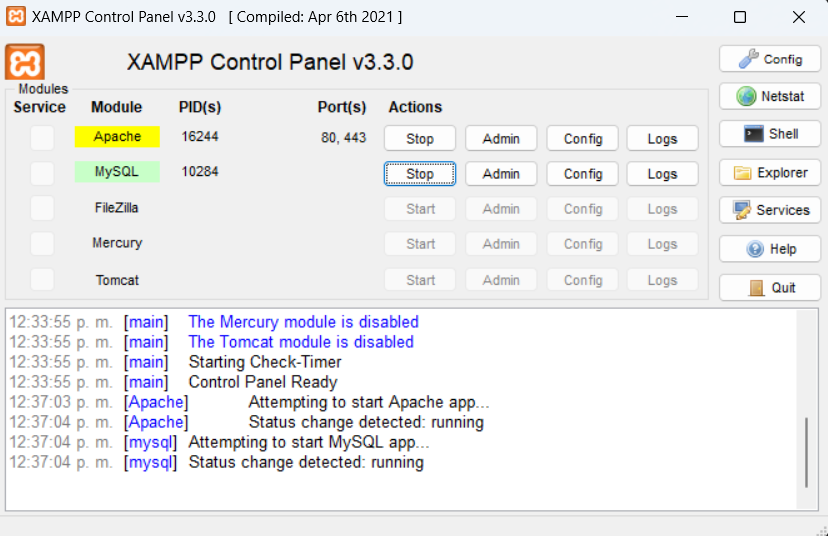

## Construccion del panel y ejecucion del proyecto

`Build`

Se contruye el panel del administrador

```
> Primero nos ubicamos en la ruta de nuestro proyecto

    cd C:/smartthinker

> Ejecutamos el siguiente codigo

    npm run build

```

`Start`

```
> Una vez construido el panel, inicializamos el proyecto

    npm run develop

```
## Interfaz de Strapi

Accediendo a la ruta, nos enviara a lo que es Strapi

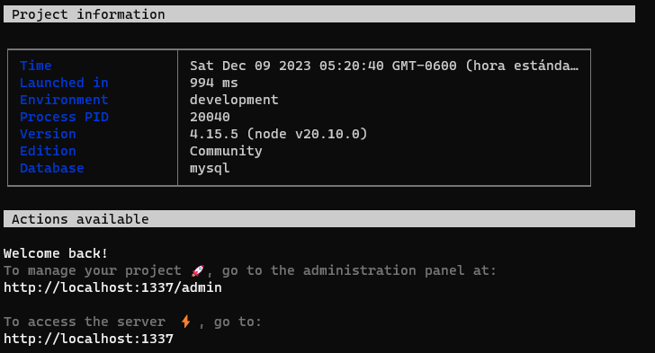

`Strapi, content type builder`

En este caso se aprecia que ya setan creadas mis cuatro tablas

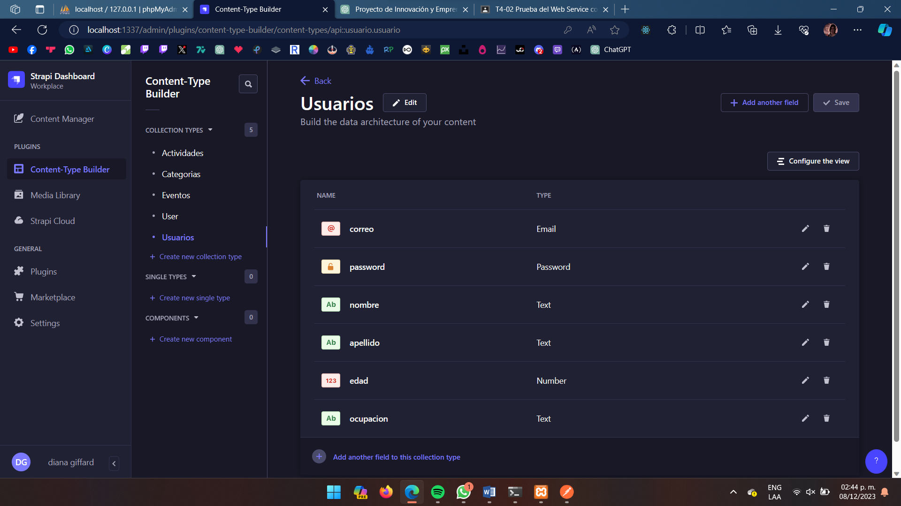

### Tour por Strapi

`Strapi, asignacion de roles`

## Pruebas de GET, POST, DELETE

Aqui se le indica los permisos que tendra cada content type creado.

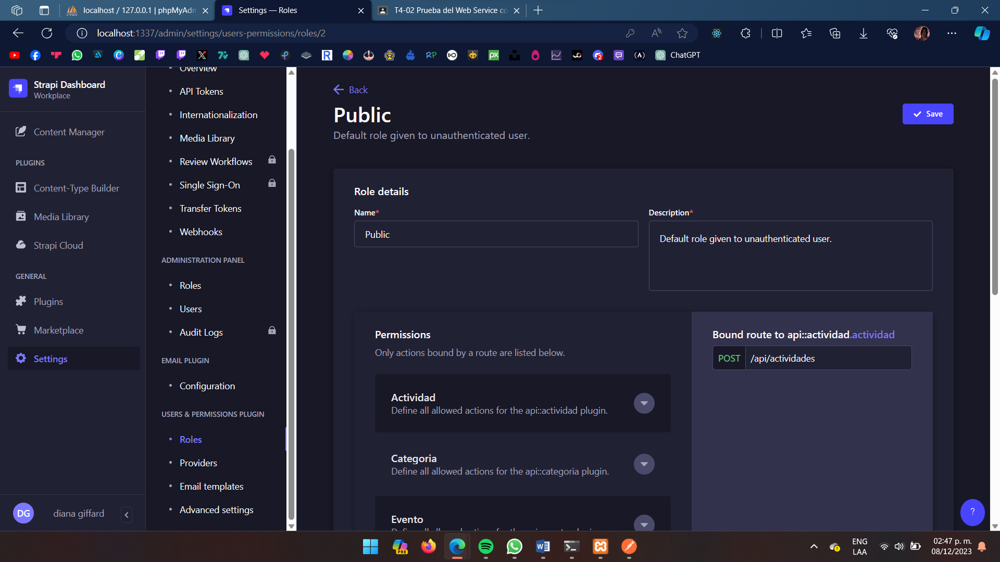

Se asignan los permisos, y de lado derecho se aprecia la ruta que se usara y los metodos permitidos.

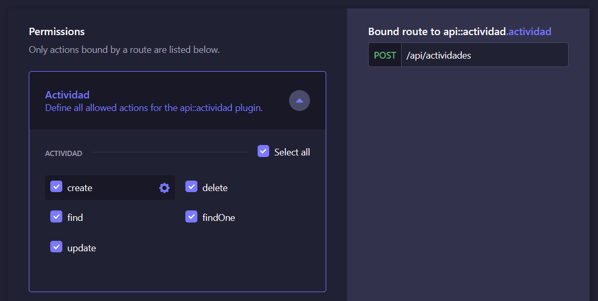

Creacion de entidades desde Strapi

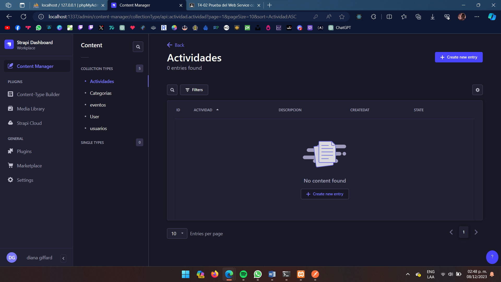

Aqui se inserto una entidad en nuestra tabla eventos

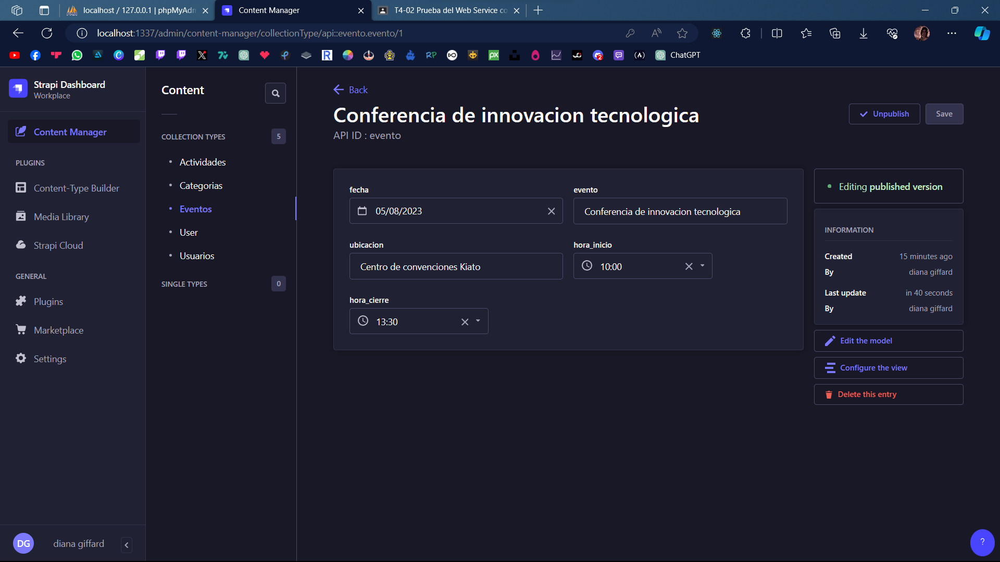

Seguido de esto se debe publicar, para poder visualizarla en Postman

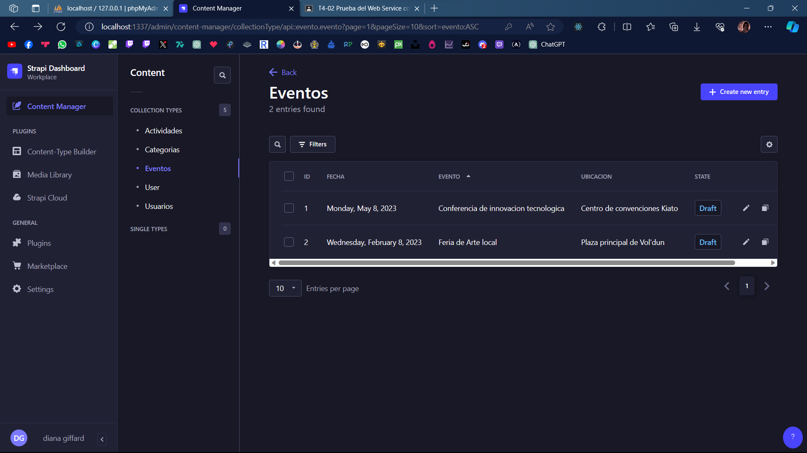

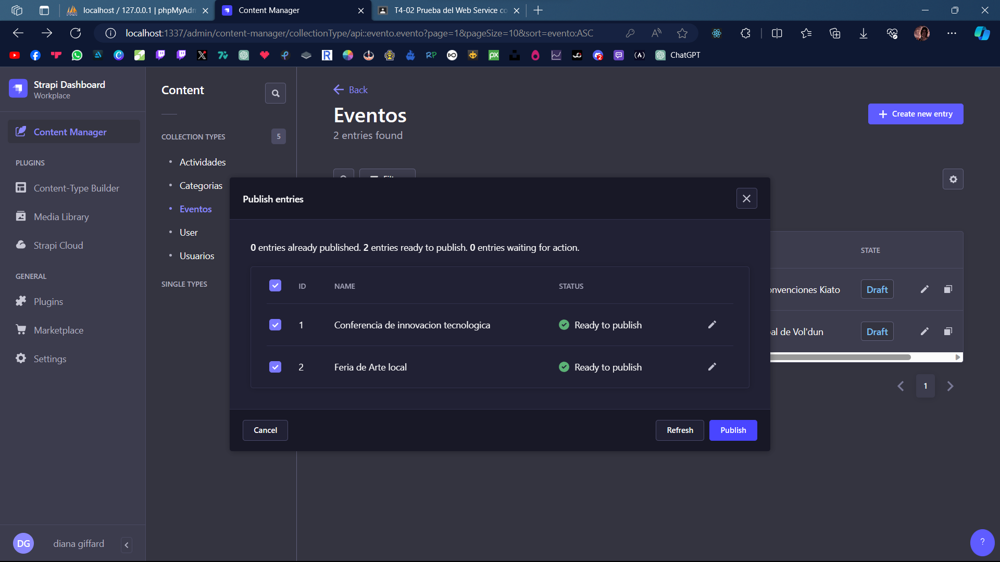

Vista desde Postman uitlizando GET

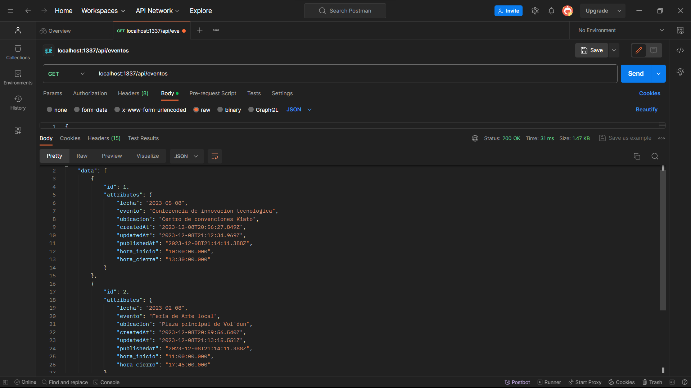

Utilizaremos POST

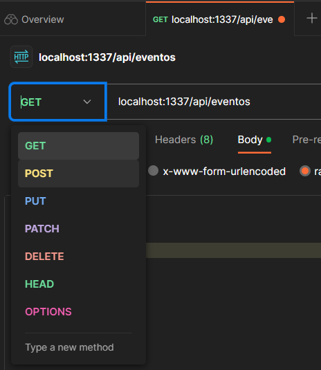
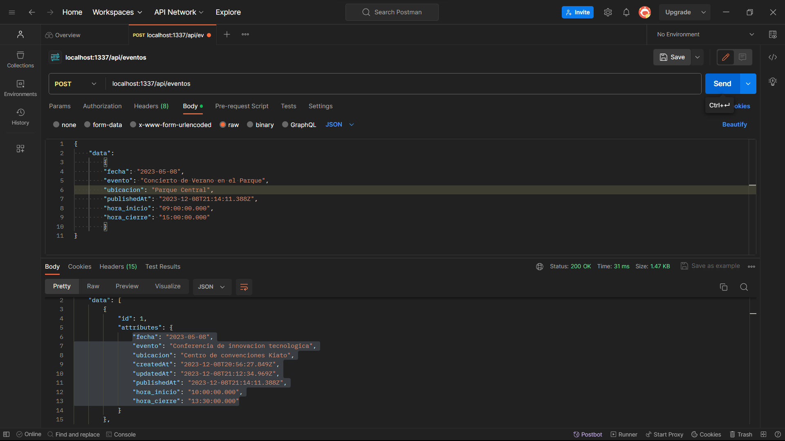
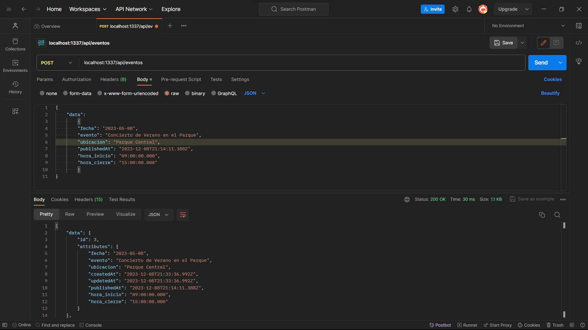

Una vez hecho el post, tambien podemos visualizarlo en Strapi y en nuestra base de datos


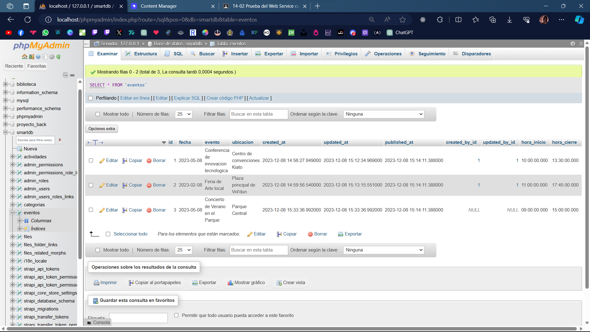

Ahora utilizaremos el metodo DELETE seguido de un POST adicional

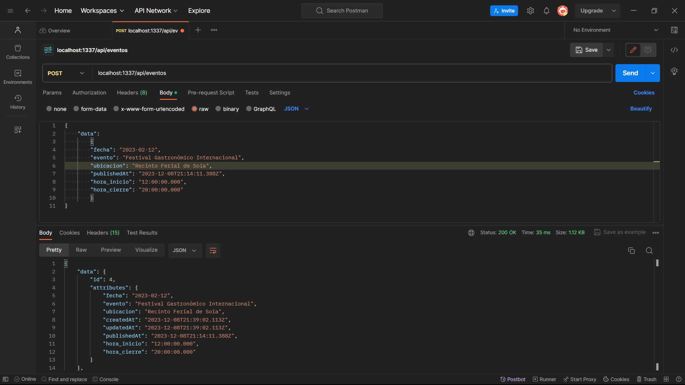

DELETE, en este metodo lo unico que debemos hacer es seguido de nuestro content type, poner el identificador unico de lo que se desee borrar

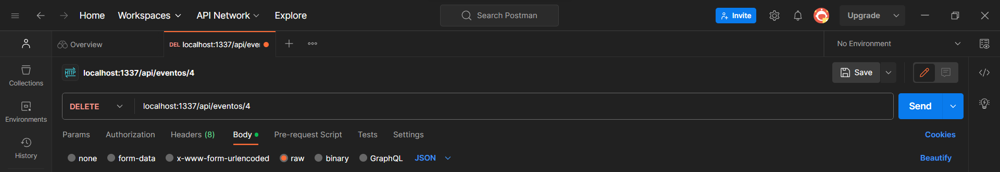

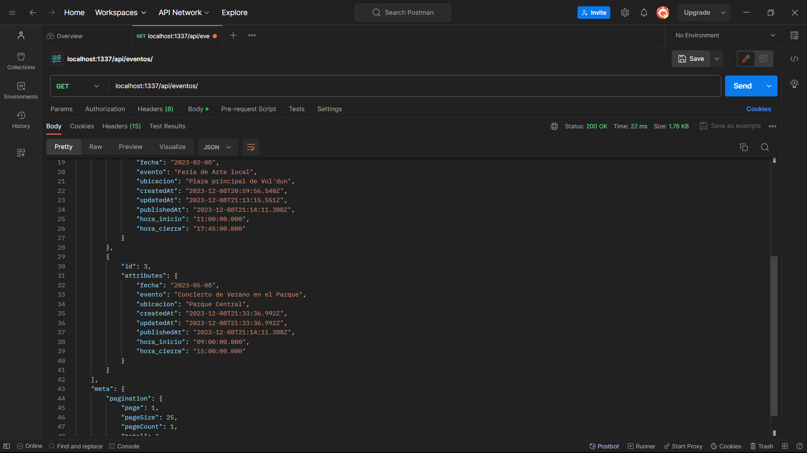

Vista en Strapi

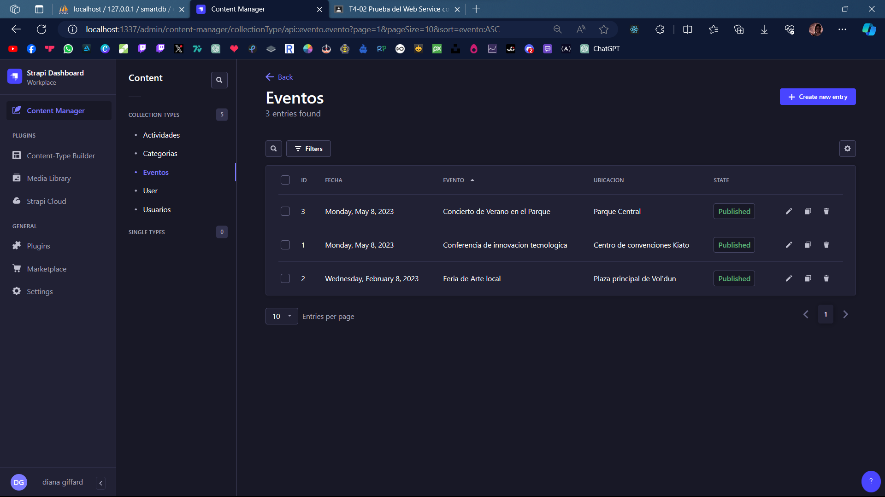

```

Los mismos pasos se hacen en cualquier tabla, ya sea crear todo desde Strapi y manipularlo desde Postman, o crear todo directamente desde Postman

```